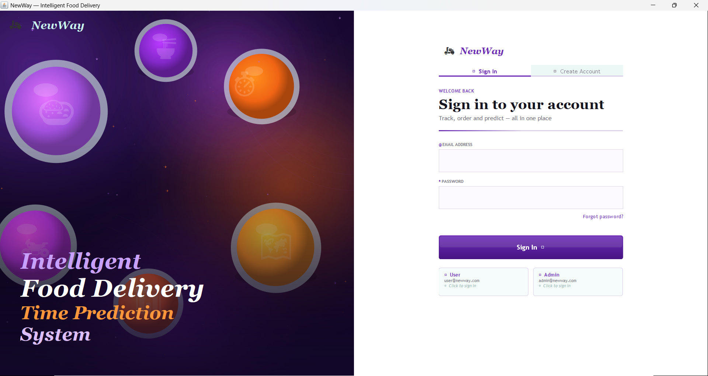
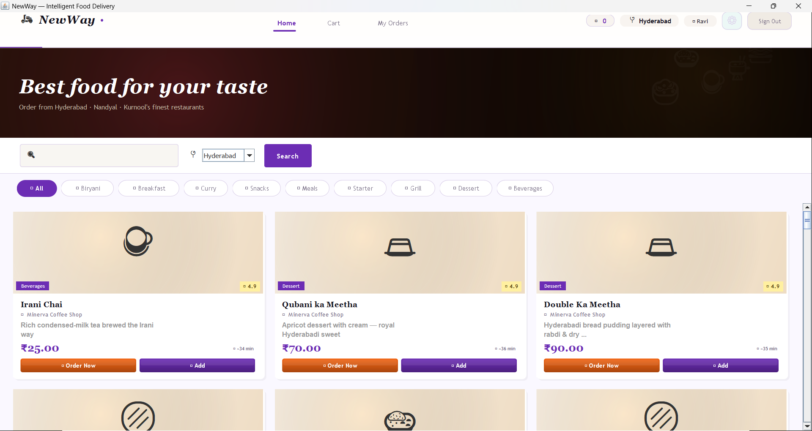
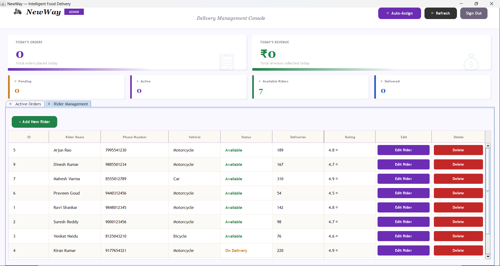

# NewWay – Intelligent Food Delivery Time Prediction System

## Overview

NewWay is a Java Swing-based Food Delivery Management System that enables users to browse food items, place orders, manage deliveries, and estimate delivery times. The application uses MySQL for database management and JDBC for database connectivity.

This project demonstrates Java desktop application development, database integration, and basic delivery time prediction functionality.

---

## Features

* User Registration and Login
* Food Ordering System
* Order Management
* Rider Management
* Admin Dashboard
* Delivery Time Prediction
* MySQL Database Integration
* Java Swing Graphical User Interface (GUI)

---

## Technologies Used

* Java
* Java Swing
* JDBC
* MySQL
* SQL
* Object-Oriented Programming (OOP)

---

## Project Structure

```text
src/
├── db/
│   ├── DBConnection.java
│   └── OrderDAO.java
├── engine/
│   └── PredictionEngine.java
├── model/
│   ├── User.java
│   ├── Order.java
│   ├── Rider.java
│   └── FoodItem.java
└── ui/
    ├── admin/
    ├── auth/
    ├── user/
    ├── DeliveryIcon.java
    └── MainFrame.java
```

---

## Prerequisites

Before running the project, ensure the following are installed:

* Java JDK
* MySQL Server
* MySQL JDBC Connector (`mysql-connector-j-8.0.33.jar`)

---

## Database Setup

1. Create a MySQL database.
2. Import the `schema.sql` file.
3. Update database credentials in `DBConnection.java` if required.

---

## Compile the Project

```bash
javac -cp ".;mysql-connector-j-8.0.33.jar" -d out src\model\User.java src\model\Order.java src\model\Rider.java src\model\FoodItem.java src\db\DBConnection.java src\db\OrderDAO.java src\engine\PredictionEngine.java src\ui\DeliveryIcon.java src\ui\auth\LoginPanel.java src\ui\user\UserDashboard.java src\ui\admin\AdminDashboard.java src\ui\MainFrame.java
```

---

## Run the Project

```bash
java -cp ".;mysql-connector-j-8.0.33.jar;out" ui.MainFrame
```

---

## Screenshots

### Login Page


### User Dashboard


### Admin Dashboard

---

## Future Enhancements

* Online Payment Integration
* Real-Time Order Tracking
* Mobile Application Version
* Machine Learning-Based Delivery Prediction
* Push Notifications
* Customer Feedback System

---

## Learning Outcomes

Through this project, the following concepts were implemented:

* Java Swing GUI Development
* JDBC Connectivity
* MySQL Database Operations
* Object-Oriented Programming
* Data Management and Processing
* Software Architecture Design

---

## Author

**Karnati Anusha**
B.Tech – Data Science

---

## License

This project is licensed under the MIT License.
